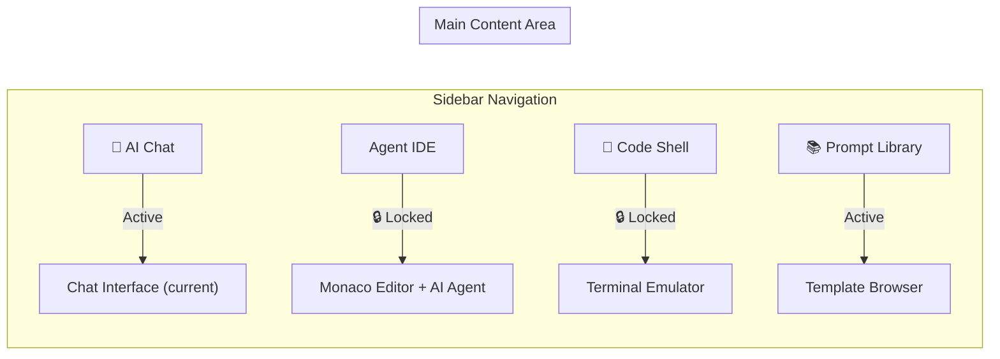

# 🚀 Nextora Agent IDE — Implementation Plan

> **Status:** Planned (Not Started)  
> **Priority:** Future Sprint  
> **Inspired by:** [mr7.ai](https://mr7.ai) multi-tool AI platform layout

---

## 🎯 Vision

Transform the Nextora AI Gateway from a single-purpose chat interface into a **multi-tool AI workspace** — similar to mr7.ai — with a persistent sidebar for navigating between different AI-powered tools. Some tools (like the Agent IDE) will be **locked/premium** initially, demonstrating the platform's extensibility.

---

## 📐 Architecture Overview



---

## 🧩 Feature Breakdown

### Tool 1: 💬 AI Chat (Already Built ✅)
- Current chat interface with streaming, intent routing, prompt guard
- Chat history sidebar with delete & auto-title
- This becomes one "tool" in the new sidebar

### Tool 2: </> Agent IDE (🔒 Locked — Phase 2)
- **Monaco Editor** (VS Code's engine) embedded in browser
- AI-powered code generation, refactoring, explanation
- File tabs, syntax highlighting, multi-language support
- "Generate" button sends editor context + prompt to Ollama
- **Locked state:** Shows a premium overlay with feature preview

### Tool 3: 🐚 Code Shell (🔒 Locked — Phase 3)
- In-browser terminal emulator (xterm.js)
- Run generated code snippets directly
- **Locked state:** Shows coming soon badge

### Tool 4: 📚 Prompt Library (Active — Already Built ✅)
- The `/api/v1/documents` endpoint with curated templates
- Browse by category, click to use in chat
- Can be rendered as a standalone tool page

---

## 🖼️ UI Layout (Planned)

```
┌──────────┬──────────────────────────────────────────────┐
│          │  ┌─────────────────────────────────────────┐  │
│  LOGO    │  │  Header: Tool Name + Model Selector     │  │
│          │  └─────────────────────────────────────────┘  │
│ ──────── │                                               │
│ 💬 Chat  │  ┌─────────────────────────────────────────┐  │
│ </> IDE 🔒│  │                                         │  │
│ 🐚 Shell🔒│  │         MAIN CONTENT AREA               │  │
│ 📚 Lib   │  │    (switches based on sidebar selection) │  │
│          │  │                                         │  │
│ ──────── │  │                                         │  │
│ Community│  └─────────────────────────────────────────┘  │
│ Settings │                                               │
│          │  ┌─────────────────────────────────────────┐  │
│ Plan:Free│  │  Quick Actions / Suggestion Chips        │  │
│ Tokens:  │  └─────────────────────────────────────────┘  │
│ 10K/10K  │                                               │
└──────────┴──────────────────────────────────────────────┘
```

---

## 🔒 Locked Feature UI Behavior

When a user clicks a locked tool:
1. Tool page loads with a **frosted glass overlay**
2. Shows a preview screenshot/mockup of the feature
3. Displays: `"Agent IDE is a Premium Feature"` badge
4. CTA button: `"Coming Soon"` or `"Upgrade to Unlock"`
5. No backend calls — purely frontend gating

---

## 🛠️ Tech Stack (Planned)

| Component | Technology | Purpose |
|-----------|-----------|---------|
| Code Editor | **Monaco Editor** (`@monaco-editor/react`) | VS Code engine in browser |
| Terminal | **xterm.js** | In-browser terminal emulator |
| Sidebar | Custom React component | Tool navigation |
| Lock Overlay | CSS glassmorphism + React state | Premium feature gating |
| Backend | Existing FastAPI + Ollama | AI code generation |

---

## 📅 Phased Rollout

### Phase 1 — UI Shell & Navigation (Frontend Only)
- [ ] Redesign sidebar from chat-only → multi-tool navigation
- [ ] Add tool icons: Chat, Agent IDE, Code Shell, Prompt Library
- [ ] Implement locked overlay component with glassmorphism
- [ ] Route switching between tools (React state, no router needed)
- [ ] Token/plan display at bottom of sidebar

### Phase 2 — Agent IDE (Working Feature)
- [ ] Install `@monaco-editor/react` in frontend
- [ ] Build IDE page with: editor pane + AI prompt pane (split view)
- [ ] "Generate Code" sends context to `/api/v1/ai` with `intent: code_generation`
- [ ] AI response streams into the editor
- [ ] File tabs, language selector, copy/download buttons
- [ ] Dark/light theme sync with existing theme toggle

### Phase 3 — Code Shell & Polish
- [ ] Install `xterm.js` for terminal emulation
- [ ] Connect to a sandboxed backend execution environment (optional)
- [ ] Or: simple "copy to clipboard" for generated code
- [ ] Add usage analytics to admin dashboard
- [ ] Community links section in sidebar

---

## 🔗 Backend Endpoints Needed (Phase 2)

```
POST /api/v1/ai/generate-code
  Body: { language, prompt, context?, temperature? }
  Response: SSE stream of generated code

GET /api/v1/ai/supported-languages
  Response: ["python", "javascript", "typescript", "go", "rust", ...]
```

> [!NOTE]
> These can reuse the existing AI request pipeline — just a new intent mapping
> pointing to `qwen2.5-coder:7b` which is already deployed and warm.

---

## 📝 Notes

- The current chat sidebar (history list) will merge INTO the main sidebar under the "Chat" tool
- No new backend dependencies needed for Phase 1 (pure frontend)
- Monaco Editor adds ~2MB to the bundle — consider lazy loading
- The locked features are a great demo for the project presentation — shows extensibility
