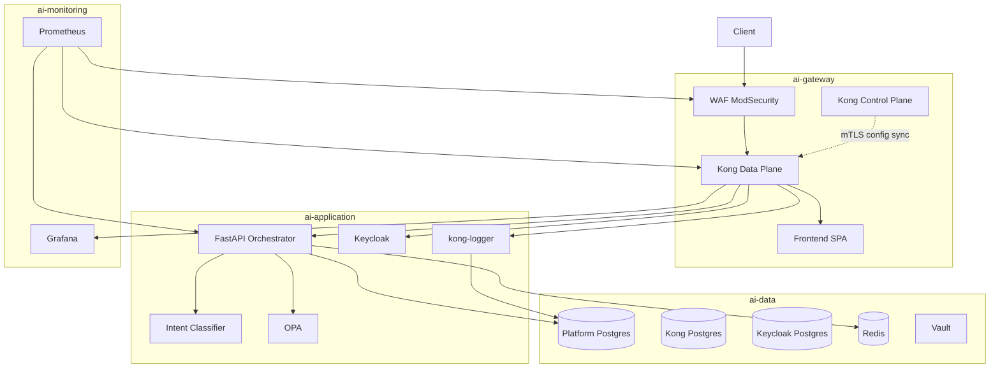

# Module 0 — Architecture Overview

## Purpose

This module gives you the mental map before diving into any single component. Every other study guide assumes you know where traffic enters, which namespace each service lives in, and where authentication actually happens.

---

## Core concepts

1. **Four namespaces, four responsibilities** — edge (`ai-gateway`), application (`ai-application`), data (`ai-data`), observability (`ai-monitoring`).
2. **Single public entry** — only the WAF Service is a LoadBalancer. Kong and FastAPI are internal.
3. **Hybrid Kong** — Control Plane holds config in Postgres; Data Plane is a stateless proxy that receives config over mTLS.
4. **Orchestration is in FastAPI** — Kong routes and meters traffic; the AI pre-flight pipeline runs in Python, not at the gateway.
5. **Defense in depth** — WAF (HTTP attacks) → Kong (rate limits, routing) → FastAPI (JWT, injection, PII, OPA) → Postgres RLS (tenant isolation at DB kernel).

---

## How it works



### Namespace layout

| Namespace | Workloads | Role |
|-----------|-----------|------|
| `ai-gateway` | WAF, Kong CP/DP, frontend | Public edge + routing |
| `ai-application` | FastAPI, intent-classifier, OPA, Keycloak, kong-logger | Business logic + identity |
| `ai-data` | platform-db, postgres-kong, postgres-keycloak, Redis, Vault | Persistence + secrets |
| `ai-monitoring` | Prometheus, Grafana, Alertmanager | Metrics + dashboards |

### Request path (simplified)

```
Browser → WAF :80 → Kong DP :8000 → upstream (FastAPI / Frontend / Keycloak / Grafana)
```

For AI chat specifically:

```
Browser → WAF → Kong → FastAPI → [classifier, OPA, provider] → SSE stream back
```

---

## Key files

| Topic | Files |
|-------|-------|
| K8s layout | `k8s/README.md`, `k8s/kustomization.yaml`, `k8s/namespaces.yaml` |
| Local dev stack | `docker-compose.yml` |
| Partial Helm chart | `helm/ai-gateway/` (FastAPI + classifier only) |
| Full deploy | `deploy.ps1` |
| Kong config source | `gateway/kong_final.yaml` |

---

## Deployment options

| Path | Scope | When to use |
|------|-------|-------------|
| **`deploy.ps1` + `k8s/`** | Full platform (4 namespaces) | Primary path; production-like K8s |
| **`docker-compose.yml`** | Full stack locally | Dev without Kubernetes; includes Loki/Promtail |
| **`helm/ai-gateway/`** | FastAPI + intent-classifier only | Partial; not the full edge stack |

---

## Wired vs scaffolded (platform-level)

| Fact | Reality |
|------|---------|
| WAF as separate container | **Active** — not a Kong plugin |
| JWT at Kong edge | **Not active** — commented out in `kong_final.yaml` |
| JWT in FastAPI | **Active** — Keycloak JWKS RS256 in `app/core/security.py` |
| Kong `tenant-restriction` plugin | **Loaded** but not attached to routes |
| `gateway-signature` HMAC | **Code exists**, not deployed |
| Helm full-stack install | **Not available** — use Kustomize |

---

## Trace exercise

1. Open `k8s/kustomization.yaml` and list every resource file it includes.
2. Open `k8s/namespaces.yaml` and name the four namespaces.
3. Confirm in `k8s/gateway/waf.yaml` that WAF Service type is `LoadBalancer` and Kong DP is `ClusterIP`.

---

## Self-check

1. What is the only public LoadBalancer in the cluster?
2. Which namespace holds FastAPI and OPA?
3. Where does JWT verification happen — Kong or FastAPI?
4. What does Kong Control Plane do vs Data Plane?
5. What deploy path covers the full platform vs only two services?

---

## Next module

[01-edge-waf.md](01-edge-waf.md) — the first hop every request takes.
