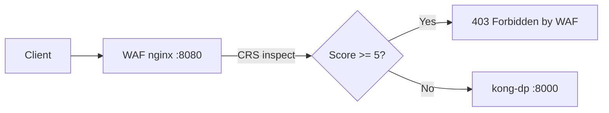

# Module 1 — Edge WAF (ModSecurity)

## Purpose

The WAF is the **first line of defense** at the network perimeter. It inspects every HTTP request with the OWASP Core Rule Set (CRS) before traffic reaches Kong. It blocks generic web attacks (SQL injection, XSS, SSRF, bad methods) that have nothing to do with your application logic.

---

## Core concepts

1. **Prevention mode** — `MODSEC_RULE_ENGINE=On` means malicious requests get **403**, not just logged.
2. **Anomaly scoring** — CRS accumulates rule scores; inbound threshold ≥ 5 triggers a block (not single-rule triggers).
3. **Paranoia level 1** — baseline CRS strictness; higher levels block more but increase false positives.
4. **Targeted exclusions** — legitimate traffic (Vite dev assets, Keycloak OIDC params, AI prompts) needs rule tuning, not WAF removal.
5. **Proxy, not terminator** — WAF forwards allowed requests to Kong; it does not run application code.

---

## How it works



### Step sequence

| Step | What happens |
|------|--------------|
| 1 | Client hits WAF LoadBalancer on port 80 (maps to pod 8080) |
| 2 | nginx receives request; ModSecurity CRS evaluates in phase 1–4 |
| 3 | Rule matches add to inbound anomaly score |
| 4 | If score ≥ `ANOMALY_INBOUND` (5) → 403 with message `Forbidden by WAF` |
| 5 | If allowed → reverse-proxy to `http://kong-dp.ai-gateway.svc.cluster.local:80` |
| 6 | Blocked requests written to JSON audit log at `/var/log/modsec_audit.log` |

### What CRS protects against

| Rule family | IDs (approx) | Attack type |
|-------------|--------------|-------------|
| SQL injection | 942xxx | `' OR '1'='1`, UNION SELECT |
| XSS | 941xxx | `<script>`, event handlers |
| SSRF | 934xxx | `redirect_uri=http://...` abuse |
| Command injection | 932xxx | shell metacharacters |
| Protocol violations | 920xxx | bad methods, restricted extensions |

---

## Exclusions (`waf/99-exclusions.sh`)

The exclusions script runs at container startup and appends rules to `REQUEST-999-COMMON-EXCEPTIONS-AFTER.conf`.

| Exclusion | Why |
|-----------|-----|
| Vite paths (`/node_modules/`, `/src/`, `/@...`) | Dev SPA assets trigger file-extension rules |
| Keycloak OIDC params (`redirect_uri`, `iss`) | Legitimate URLs look like SSRF |
| Keycloak cookies (`AUTH_SESSION_ID`, `KEYCLOAK_*`) | Session tokens look like SQLi |
| **`/api/v1/ai/`** | AI prompts contain code/SQL/HTML that triggers 941xxx/942xxx |
| **`/grafana`** | Grafana HTML/JS responses trigger outbound CRS XSS rules (infinite loading spinner) |

### AI route exclusion (important)

For `/api/v1/ai/`, the WAF removes SQLi (942xxx), XSS (941xxx), and related rules — **not the entire WAF**. Other CRS rules still apply. Application-layer security (JWT, injection scan, OPA) handles AI-specific threats.

---

## Metrics and observability

| Component | Port | Metrics |
|-----------|------|---------|
| WAF nginx | 8080 | Traffic proxy |
| nginx-prometheus-exporter sidecar | 9113 | Connection count, request rate |

Prometheus scrapes `:9113` in K8s (`monitoring/prometheus.k8s.yml`). Grafana dashboard: `monitoring/grafana/dashboards/waf-edge-security.json`.

Audit log inspection:
```sh
kubectl exec -n ai-gateway deploy/waf -c waf -- tail -f /var/log/modsec_audit.log
```

---

## Key files

| Topic | Files |
|-------|-------|
| Image build | `waf/Dockerfile` (FROM `owasp/modsecurity-crs:nginx`) |
| Exclusion rules | `waf/99-exclusions.sh` |
| K8s deployment | `k8s/gateway/waf.yaml` |
| Verification script | `scripts/test-waf-k8s.ps1` |

### Key config values (`k8s/gateway/waf.yaml`)

| Env var | Value | Meaning |
|---------|-------|---------|
| `BACKEND` | `http://kong-dp.ai-gateway.svc.cluster.local:80` | Upstream after WAF pass |
| `MODSEC_RULE_ENGINE` | `On` | Block mode |
| `PARANOIA` | `1` | CRS strictness |
| `ANOMALY_INBOUND` | `5` | Block threshold |
| `MSG_403` | `Forbidden by WAF` | Client-facing block message |

---

## Wired vs scaffolded

| Feature | Status |
|---------|--------|
| ModSecurity CRS blocking | Active |
| WAF as sole LoadBalancer | Active (K8s) |
| AI path rule removal | Active |
| WAF metrics in Prometheus | Active (K8s) |
| Edge HTTPS termination at WAF | Dev uses HTTP :80; production pattern in `k8s/edge-tls-production-ingress.example.yaml` |

---

## Trace exercise

1. With the cluster running, hit a SQLi probe:
   ```sh
   curl -i "http://localhost/?id=1%27+OR+%271%27%3D%271"
   ```
   Expect **403 Forbidden by WAF**.

2. Send a normal AI request through the UI or API — it should pass WAF (exclusion applies) and reach Kong.

3. Check audit log for the blocked request:
   ```sh
   kubectl exec -n ai-gateway deploy/waf -c waf -- grep -c '"action"' /var/log/modsec_audit.log
   ```

---

## Self-check

1. What happens when inbound anomaly score reaches 5?
2. Why does `/api/v1/ai/` need WAF exclusions?
3. What still protects the AI endpoint after WAF rule removal?
4. Where does WAF proxy allowed traffic?
5. How do you verify WAF is blocking attacks?

---

## Next module

[02-kong-gateway.md](02-kong-gateway.md) — routing, rate limits, and plugins after WAF.
