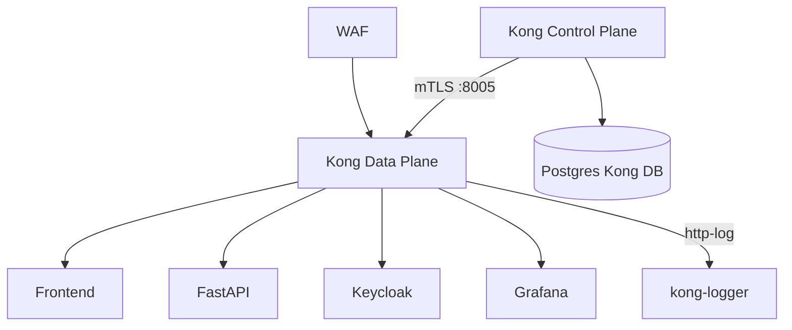

# Module 2 — Kong API Gateway

## Purpose

Kong is the **API management layer** after WAF. It routes traffic to the correct upstream, enforces rate limits and payload size, stamps requests with correlation IDs, and ships access logs to kong-logger. It does **not** run AI logic — that is FastAPI's job.

---

## Core concepts

1. **Hybrid mode** — Control Plane (CP) owns config in Postgres; Data Plane (DP) is a stateless proxy synced over mTLS.
2. **Declarative config** — `gateway/kong_final.yaml` is the source of truth, pushed via `deck sync`.
3. **Global vs route plugins** — some plugins apply to all traffic; others only to specific paths.
4. **Kong stamp** — `request-transformer` adds `kong-header: true`; FastAPI rejects requests without it.
5. **Local rate limiting** — `policy: local` means counters are per DP pod, not cluster-wide Redis.

---

## How it works



### Route table (`gateway/kong_final.yaml`)

| Path | Upstream | Notable plugins |
|------|----------|-----------------|
| `/` | frontend (upstream) | — |
| `/api` | fastapi:3000 | size limit 2MB, correlation-id |
| `/api/v1/ai/request` | fastapi:3000 | rate limit, size limit 1MB, correlation-id |
| `/auth` | keycloak:8080 | pre/post-function (localhost redirect fixes) |
| `/grafana` | grafana:3000 | — |

### Global plugins (all routes)

| Plugin | Effect |
|--------|--------|
| `correlation-id` | Generates `X-Request-ID`, echoes downstream |
| `http-log` | POST access logs to kong-logger `:9999/logs` |
| `prometheus` | Exposes metrics on Status API `:8100` |

### AI route plugins (`/api/v1/ai/request`)

| Plugin | Config | Effect |
|--------|--------|--------|
| `rate-limiting` | 10/s, 100/min, 1000/hr, `limit_by: consumer`, `policy: local` | Throttle abuse |
| `request-size-limiting` | 1 MB | Cap prompt payload |
| `correlation-id` | UUID | Trace ID propagation |

### Service-level plugin (fastapi service)

| Plugin | Effect |
|--------|--------|
| `request-transformer` | Adds header `kong-header: true` on every proxied FastAPI request |

---

## Config sync flow

```
gateway/kong_final.yaml
  → ConfigMap kong-deck-config
  → Job kong-deck-sync (deck gateway sync)
  → Kong CP Admin API :8001
  → mTLS push to Kong DP pods
```

Admin UI can also mutate plugins at runtime via FastAPI → Kong Admin API (`fastapi_backend/app/api/admin/gateway_plugins.py`), which can cause drift from declarative config.

---

## Custom Lua plugins

| Plugin | Location | Purpose | Status |
|--------|----------|---------|--------|
| `simple-validator` | `gateway/plugins/simple-validator/` | Validates required JSON body keys | Loaded; attach per route |
| `tenant-restriction` | `gateway/plugins/tenant-restriction/` | Parses JWT payload → `X-Tenant-ID` (no sig verify) | Loaded; **not on routes** |
| `gateway-signature` | `gateway/plugins/gateway-signature/` | HMAC-SHA256 upstream signing | **Not in KONG_PLUGINS** |

---

## Wired vs scaffolded

| Feature | Status |
|---------|--------|
| Rate limit on AI route | Active |
| `kong-header: true` stamp | Active |
| http-log → kong-logger | Active |
| prometheus metrics | Active |
| Kong JWT plugin | Commented out in `kong_final.yaml` |
| `tenant-restriction` on routes | Not attached |
| `gateway-signature` HMAC | Code exists, not deployed |
| HTTPS redirect (global pre-function) | `enabled: false` |

---

## Key files

| Topic | Files |
|-------|-------|
| Declarative config | `gateway/kong_final.yaml` |
| Control Plane | `k8s/gateway/kong-cp.yaml` |
| Data Plane | `k8s/gateway/kong-dp.yaml` |
| Deck sync job | `k8s/gateway/kong-deck-sync.yaml` |
| Custom plugins | `gateway/plugins/` |
| Runtime plugin admin | `fastapi_backend/app/api/admin/gateway_plugins.py` |

---

## Trace exercise

1. Read `gateway/kong_final.yaml` and list every route path and its upstream URL.
2. Identify which plugins apply globally vs only to `/api/v1/ai/request`.
3. Port-forward Kong Admin (`start-ui.ps1` or `kubectl port-forward`) and confirm routes match declarative config.
4. Rapid-fire 15 requests to `/api/v1/ai/request` — observe Kong 429 when rate limit hits.

---

## Self-check

1. What is the difference between Kong CP and DP?
2. Which header does Kong add so FastAPI knows traffic came through the gateway?
3. What are the AI route rate limits?
4. Why is `policy: local` a limitation when Kong DP scales horizontally?
5. Name two scaffolded features that exist in code but are not active.

---

## Next module

[03-network-zero-trust.md](03-network-zero-trust.md) — why Kong is not publicly reachable.
