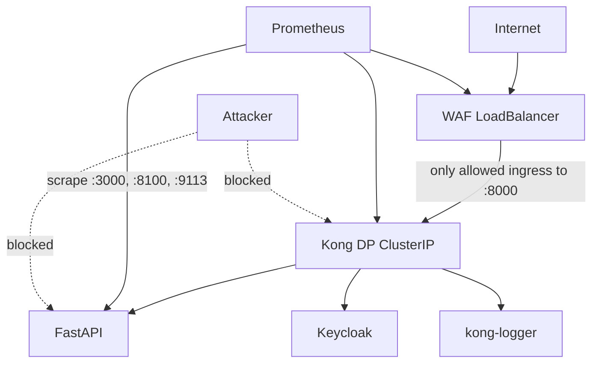

# Module 3 — Network Zero-Trust

## Purpose

NetworkPolicies enforce **default-deny** connectivity in Kubernetes. Combined with WAF as the sole LoadBalancer and FastAPI's `verify_kong_header`, they ensure attackers cannot bypass the edge stack by hitting internal services directly.

---

## Core concepts

1. **Default deny** — `ai-data`, `ai-application`, and `ai-monitoring` block all ingress and egress unless explicitly allowed.
2. **WAF-only Kong ingress** — only WAF pods may connect to Kong DP on port 8000 for proxy traffic.
3. **ClusterIP internal services** — Kong DP, FastAPI, and databases have no public IP.
4. **Prometheus scrape paths** — explicit allow rules let Prometheus reach `/metrics` endpoints without opening broad access.
5. **Trust model** — `kong-header: true` is not cryptographic; it assumes NetworkPolicy prevents direct FastAPI access.

---

## How it works

### Critical policies (`k8s/network-policies.yaml`)

| Policy | Effect |
|--------|--------|
| `allow-waf-ingress` | Any source → WAF :8080 (LoadBalancer requirement) |
| `allow-waf-egress` | WAF → kong-dp:8000 + DNS |
| `allow-kong-dp-from-waf` | **Only WAF** may ingress kong-dp:8000 |
| `allow-kong-dp-egress` | Kong → FastAPI, Keycloak, kong-logger, Redis, frontend, Grafana |
| `allow-fastapi-ingress-from-kong` | Only Kong → FastAPI :3000 |
| `allow-prometheus-scrape-*` | Prometheus → component metrics ports |

### Why Kong DP is ClusterIP

If Kong DP were a LoadBalancer, traffic could bypass WAF. The design intentionally exposes only WAF publicly. NetworkPolicy `allow-kong-dp-from-waf` reinforces this at the kernel level.

---

## TLS model (three separate concerns)

| Layer | Certs | Purpose |
|-------|-------|---------|
| CP ↔ DP mTLS | `kong-cluster-certs` secret (Vault path `secret/kong/cluster`) | Config sync over :8005/:8006 |
| Client → edge | WAF :80 (dev HTTP) or Ingress + cert-manager (production) | Browser HTTPS |
| Kong :8443 | Self-signed cert in `kong_final.yaml` certificates section | Direct HTTPS to DP if ever reached internally |

**Never reuse cluster mTLS certs for browser HTTPS.**

Production pattern: `k8s/edge-tls-production-ingress.example.yaml` — Ingress terminates TLS and forwards to WAF :80.

---

## Key files

| Topic | Files |
|-------|-------|
| All network rules | `k8s/network-policies.yaml` |
| WAF service type | `k8s/gateway/waf.yaml` |
| Kong DP service type | `k8s/gateway/kong-dp.yaml` |
| Production TLS example | `k8s/edge-tls-production-ingress.example.yaml` |
| Kong header enforcement | `fastapi_backend/app/core/middleware.py` |

---

## Wired vs scaffolded

| Feature | Status |
|---------|--------|
| Default-deny namespaces | Active |
| WAF-only Kong ingress | Active |
| Prometheus scrape policies | Active |
| Production Ingress TLS | Example manifest only |
| HMAC gateway signature | Not deployed (would strengthen trust beyond header check) |

---

## Trace exercise

1. Open `k8s/network-policies.yaml` and find the rule that allows WAF → Kong DP.
2. Confirm Kong DP Service in `k8s/gateway/kong-dp.yaml` is `type: ClusterIP`.
3. Try port-forwarding FastAPI directly and calling `/api/v1/ai/request` without `kong-header` — expect 403 from `verify_kong_header`.
4. Sketch which pods can talk to `platform-db:5432` (only FastAPI, kong-logger, Grafana per policies).

---

## Self-check

1. Why is Kong DP ClusterIP instead of LoadBalancer?
2. What NetworkPolicy ensures WAF is the only ingress to Kong proxy port?
3. Why is `kong-header: true` not sufficient security on its own?
4. Name three separate TLS concerns in this architecture.
5. Can Prometheus scrape FastAPI metrics without a specific allow rule?

---

## Next module

[04-identity-auth.md](04-identity-auth.md) — who the user is and how tenants are isolated.
