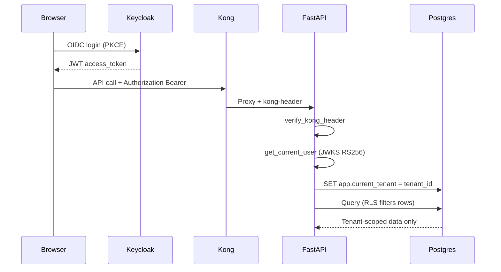

# Module 4 — Identity & Authentication

## Purpose

Keycloak issues cryptographically signed JWTs. FastAPI validates them against Keycloak's JWKS endpoint and uses claims (`tenant_id`, roles) to enforce multi-tenant isolation via PostgreSQL Row-Level Security (RLS).

---

## Core concepts

1. **OAuth 2.0 PKCE in browser** — frontend uses Keycloak JS adapter with `login-required`; no client secret in SPA.
2. **JWT in FastAPI, not Kong** — full RS256 verification with JWKS happens in `app/core/security.py`; Kong JWT plugin is disabled.
3. **`tenant_id` claim** — injected by Keycloak realm mapper; drives RLS session variable `app.current_tenant`.
4. **RLS at DB kernel** — even if application code sends a wrong query, Postgres refuses cross-tenant rows.
5. **Admin vs user routes** — admin APIs check `realm_access.roles` for admin role in addition to JWT validity.

---

## How it works

### Step sequence

| Step | Component | Action |
|------|-----------|--------|
| 1 | `AuthContext.jsx` | Keycloak init with `onLoad: 'login-required'` |
| 2 | Keycloak | Issues JWT with `tenant_id`, `sub`, `realm_access.roles` |
| 3 | Frontend | Attaches `Authorization: Bearer <token>` on API calls |
| 4 | FastAPI deps | `verify_kong_header` → `get_current_user` → `get_db_with_user` |
| 5 | `get_current_user` | Fetches JWKS, validates RS256 signature, checks issuer/exp |
| 6 | `get_db_with_user` | Sets `app.current_tenant` and `app.is_admin` on DB session |
| 7 | Postgres RLS | Policies filter all queries by tenant automatically |

### JWT validation details (`app/core/security.py`)

- JWKS URL: `{keycloak_url}/realms/{realm}/protocol/openid-connect/certs`
- JWKS cached in memory after first fetch
- Multiple valid issuers accepted (internal K8s DNS, localhost, public IP) for dev flexibility
- Clock skew leeway on `exp` claim

---

## Key files

| Topic | Files |
|-------|-------|
| Frontend auth | `frontend/src/context/AuthContext.jsx` |
| API client token wiring | `frontend/src/api/client.js` |
| JWT verification | `fastapi_backend/app/core/security.py` |
| RLS session setup | `fastapi_backend/app/infrastructure/db/session.py` |
| ORM tenant filters | `fastapi_backend/app/infrastructure/db/tenant_filters.py` |
| Keycloak realm config | `keycloak/realm-export.json` |
| Route dependencies | `fastapi_backend/app/api/dependencies.py` |

---

## Wired vs scaffolded

| Feature | Status |
|---------|--------|
| Keycloak OIDC login | Active |
| JWT RS256 in FastAPI | Active |
| RLS tenant isolation | Active |
| Kong JWT plugin | Commented out |
| Kong `tenant-restriction` (JWT decode only) | Loaded, not on routes |
| Token refresh in frontend | Every 30s in AuthContext |

---

## Trace exercise

1. Log in via the UI; open browser DevTools → Network → find an API call and inspect the `Authorization` header.
2. Decode the JWT payload (jwt.io or base64) and find `tenant_id` and `realm_access.roles`.
3. Read `get_db_with_user` in `session.py` — identify the SQL `SET` commands for RLS.
4. Call a protected admin endpoint without a token — expect 401.

---

## Self-check

1. Where is JWT signature verification performed?
2. What claim drives PostgreSQL tenant isolation?
3. What happens if you call FastAPI directly without going through Kong?
4. Why does FastAPI accept multiple JWT issuers?
5. What is the difference between Kong JWT plugin and FastAPI JWT validation?

---

## Next module

[05-ai-orchestration.md](05-ai-orchestration.md) — the core request pipeline after auth.
