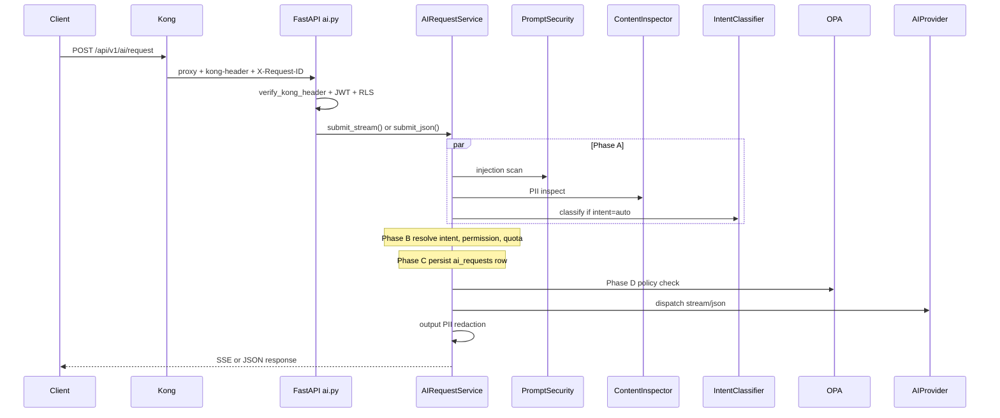

# Module 5 — AI Orchestration

## Purpose

This is the **heart of the project**. FastAPI's `AIRequestService` orchestrates every AI request through a fixed pre-flight pipeline before calling a provider and streaming the response back. Kong gets traffic to the backend; this service decides if, how, and where to execute.

---

## Core concepts

1. **Single entry point** — `POST /api/v1/ai/request` in `app/api/ai.py`.
2. **Pre-flight pipeline** — shared `_run_pre_flight()` for both SSE stream and JSON responses.
3. **Parallel Phase A** — injection scan, PII inspect, and intent classify run concurrently via `asyncio.TaskGroup`.
4. **Deterministic routing** — one intent maps to exactly one `service_id` from the DB.
5. **SSE streaming** — `Accept: text/event-stream` triggers token-by-token response like ChatGPT.

---

## How it works

### Pre-flight phases (`_run_pre_flight`)

| Phase | What runs | Outcome |
|-------|-----------|---------|
| **Entry** | Kong header, JWT, tenant from token | 403/401 if invalid |
| **A — Parallel** | Prompt security, content inspect, intent classify (if `auto`) | Block injection; upgrade sensitivity if PII; resolve intent |
| **B — Routing** | `resolve_intent()` → `service_id`; tenant permission; Redis quota; load `ai_services` row | 403/429/422 if denied |
| **C — Record** | `create_ai_request()` with upgraded sensitivity | Audit trail in Postgres |
| **D — Policy** | OPA `evaluate_async()` with `{sensitivity, tenant, service_type}` | 403 if policy denies |
| **Execute** | `_dispatch_provider_stream/json()` | Call Ollama/OpenAI/Gemini |
| **Post-flight** | Output guard redaction; quota increment; usage log | PII scrubbed on outbound stream |

### Security gates in order

1. WAF (HTTP patterns)
2. Kong rate limit + size limit
3. `verify_kong_header`
4. JWT (`get_current_user`)
5. RLS (`get_db_with_user`)
6. Prompt injection scan
7. PII inspect (sensitivity upgrade)
8. Intent resolve
9. Tenant-service permission
10. Redis token quota
11. OPA policy
12. Output guard (response path)

### SSE vs JSON

| Header | Method | Response |
|--------|--------|----------|
| `Accept: text/event-stream` | `submit_stream()` | SSE frames: `thinking` → tokens → `done:true` metadata |
| `Accept: application/json` | `submit_json()` | Full JSON response with debug headers |

SSE error shape maps domain exceptions (`PolicyViolationError`, `SecurityViolationError`, `QuotaExceededError`) to JSON inside SSE frames.

---

## Key files

| Topic | Files |
|-------|-------|
| HTTP entry | `fastapi_backend/app/api/ai.py` |
| Orchestrator | `fastapi_backend/app/services/ai_request_service.py` |
| Request schema | `fastapi_backend/app/schemas/ai_request.py` |
| Kong header check | `fastapi_backend/app/core/middleware.py` |
| App wiring | `fastapi_backend/app/main.py` (service composition, lifespan) |

### Key functions

| Function | Role |
|----------|------|
| `_run_pre_flight()` | Shared pipeline for stream + JSON |
| `submit_stream()` / `submit_json()` | Public entry from router |
| `_dispatch_provider_stream/json()` | Provider selection and HTTP call |
| `_run_prompt_security_scan()` | Injection gate + security_events |

---

## Wired vs scaffolded

| Feature | Status |
|---------|--------|
| Full pre-flight pipeline | Active |
| SSE streaming | Active |
| Parallel Phase A | Active |
| OPA policy gate | Active |
| gateway-signature HMAC verify | Not enforced (header-only check) |

---

## Trace exercise

1. Read `_run_pre_flight()` in `ai_request_service.py` — mark where Phase A, B, C, D start.
2. Send a chat with `intent: "auto"` and watch logs for intent resolution line.
3. Send with an explicit intent (e.g. `code_generation`) — classifier runs in shadow or is skipped depending on config.
4. Trigger a policy block (configure `deny_cloud` in admin) and observe 403 in SSE error frame.

---

## Self-check

1. What runs in parallel during Phase A?
2. What is the difference between Phase B and Phase D?
3. How does the API choose SSE vs JSON response?
4. List all security gates in order from WAF to output guard.
5. Where is the `ai_requests` row created?

---

## Related modules

- Security details: [06-security-services.md](06-security-services.md)
- Classifier: [07-intent-classifier.md](07-intent-classifier.md)
- OPA: [08-opa-governance.md](08-opa-governance.md)
- Providers: [09-ai-providers.md](09-ai-providers.md)

---

## Next module

[06-security-services.md](06-security-services.md) — deep dive into each security service.
