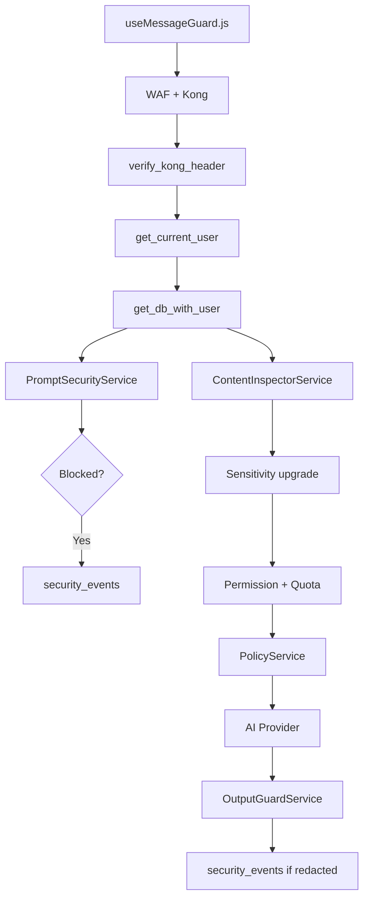

# Module 6 — Security Services

## Purpose

Security is not one check — it is **layered services** that run at different points in the request lifecycle. This module explains each service in isolation: what it detects, when it runs, and what happens on a match.

---

## Core concepts

1. **Client-side guard first** — `useMessageGuard.js` blocks obvious issues before the network call.
2. **Input vs output** — Presidio runs on inbound messages (sensitivity upgrade) and outbound tokens (redaction).
3. **Regex + ML for injection** — pattern library plus optional DistilBERT classifier; cumulative score ≥ 1.0 blocks.
4. **Quota fail-open** — if Redis is down, quota check allows the request (availability over strict enforcement).
5. **Audit everything** — blocks and redactions write to `security_events` table.

---

## Security service map

---

## PromptSecurityService

**File:** `fastapi_backend/app/services/prompt_security_service.py`

| Aspect | Detail |
|--------|--------|
| When | Phase A (parallel with inspect + classify) |
| Input | List of chat messages |
| Method | Regex patterns (ignore instructions, DAN jailbreak, etc.) + optional DistilBERT `InjectionClassifier` |
| Threshold | Cumulative score ≥ 1.0 → `SecurityViolationError` (403) |
| Audit | `security_events` with prompt hash (never stores plaintext) |

Patterns are reloadable from DB via admin API (`security_patterns`).

---

## ContentInspectorService

**File:** `fastapi_backend/app/services/content_inspector_service.py`

| Aspect | Detail |
|--------|--------|
| When | Phase A (parallel) |
| Engine | Microsoft Presidio + regex for credit cards, emails, etc. |
| Effect | Upgrades declared sensitivity LOW/MEDIUM → HIGH when PII detected |
| Downstream | Upgraded sensitivity feeds OPA policy context in Phase D |

---

## OutputGuardService

**File:** `fastapi_backend/app/services/output_guard_service.py`

| Aspect | Detail |
|--------|--------|
| When | Post-provider, on every streamed token or full JSON |
| Engine | Presidio redaction |
| Effect | Replaces PII in AI response before client sees it |
| Audit | Logs `pii_redaction` security events |

Streaming uses windowed chunk redaction to handle tokens split across PII boundaries.

---

## QuotaService

**File:** `fastapi_backend/app/services/quota_service.py`

| Aspect | Detail |
|--------|--------|
| When | Phase B (check) and post-success (increment) |
| Store | Redis daily token counter per tenant |
| Deny | `QuotaExceededError` → 429 |
| Fail-open | Redis unreachable → allow request |
| Config | `fastapi_backend/quotas.yaml` + DB overrides |

---

## Permission check

**File:** `fastapi_backend/app/repositories/permission_repository.py`

| Aspect | Detail |
|--------|--------|
| When | Phase B |
| Store | `tenant_service_permissions` table |
| Deny | `TenantNotAuthorizedError` → 403 |
| Audit | Permission denial logged |

---

## Client-side guard

**File:** `frontend/src/hooks/useMessageGuard.js`

| Check | Behavior |
|-------|----------|
| Injection/SQL patterns | Hard block — cannot send |
| Length/rate limits | Hard block |
| PII/secrets detected | Soft warn — modal, user can proceed |

This is UX defense, not a security boundary — backend checks are authoritative.

---

## Key files

| Service | File |
|---------|------|
| Prompt injection | `app/services/prompt_security_service.py` |
| Input PII | `app/services/content_inspector_service.py` |
| Output redaction | `app/services/output_guard_service.py` |
| Quota | `app/services/quota_service.py` |
| Permissions | `app/repositories/permission_repository.py` |
| Security events | `app/repositories/security_event_repository.py` |
| Client guard | `frontend/src/hooks/useMessageGuard.js` |

---

## Wired vs scaffolded

| Feature | Status |
|---------|--------|
| Regex injection patterns | Active |
| DistilBERT injection model | Active if model loaded at startup |
| Presidio input/output | Active |
| Redis quota | Active (fail-open) |
| Client message guard | Active (soft/hard blocks) |
| Admin security pattern CRUD | Active |

---

## Trace exercise

1. Send a message containing "ignore all previous instructions" — expect prompt guard block.
2. Send a message with a fake credit card number — observe sensitivity upgrade in response metadata or policy effect.
3. Check `security_events` table (admin UI or SQL) after a block.
4. Stop Redis pod temporarily and confirm AI requests still work (fail-open).

---

## Self-check

1. What score threshold blocks a prompt injection?
2. What is the difference between ContentInspector and OutputGuard?
3. What happens when Redis is unavailable during quota check?
4. Does the client-side guard replace backend security?
5. Where are security blocks audited?

---

## Next module

[07-intent-classifier.md](07-intent-classifier.md) — how intent drives routing and cost.
