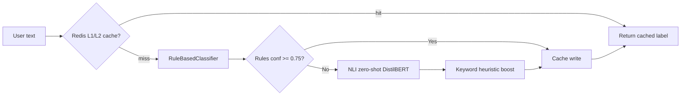

# Module 7 — Intent Classifier

## Purpose

The intent classifier decides **what the user is trying to do** before an expensive AI provider call. It enables cost optimization (local Ollama for simple chat, cloud APIs for advanced tasks) and feeds deterministic routing to the correct `service_id`.

---

## Core concepts

1. **Standalone microservice** — FastAPI on `:3010`, separate from the orchestrator.
2. **Hybrid pipeline** — cache → rules → NLI (DistilBERT zero-shot) → keyword heuristic.
3. **Rules win when confident** — if regex rules score ≥ 0.75, NLI is skipped.
4. **Taxonomy v1** — shared YAML defines valid labels for both classifier and orchestrator.
5. **Failure → unclassified** — HTTP errors or unknown labels route to fallback intent.

---

## How it works



### Pipeline tiers

| Tier | Source | When used |
|------|--------|-----------|
| Cache | Redis L2 + in-process LRU L1 | Key = tenant + text fingerprint |
| Rules | Regex patterns per intent | Wins if confidence ≥ 0.75 |
| NLI | `typeform/distilbert-base-uncased-mnli` | Zero-shot when rules weak |
| Heuristic | Keyword boosts | Fallback boost |

Implementation: `intent_classifier_service/app/classify_pipeline.py` — `classify_text()` → `merge_results()`.

### Taxonomy (`intent_taxonomy/intent_labels_v1.yaml`)

| Label | Typical routing |
|-------|-----------------|
| `general_chat` | Local Ollama (free) |
| `code_generation` | Ollama coder or cloud |
| `summarization` | Mid-tier model |
| `advanced_chat` | Cloud API (Gemini, etc.) |
| `unclassified` | Default fallback service |

---

## Orchestrator integration

**Client:** `fastapi_backend/app/infrastructure/intent_classifier/client.py`

| Mode | When classifier runs | Effect on routing |
|------|------------------------|-------------------|
| `auto` | Always | Classifier decides `intent_name` |
| Manual (explicit intent) | Optional shadow | User intent used; shadow logs prediction |
| Shadow (`INTENT_CLASSIFIER_SHADOW=true`) | Always | Logs prediction but keeps user intent |

After classification, `IntentCacheService.resolve_intent(intent_name)` maps intent → `service_id` from `intent_routing` table (refreshed every 30s).

---

## API contract

```
POST /classify
Body: { "text": "...", "tenant_id": "...", "environment": "..." }
Response: { "intent_label", "confidence", "source", "taxonomy_version", "model_id" }
```

Health: `GET /healthz`, `GET /readyz`, `GET /metrics`

---

## Cost optimization story

Classification happens **before** provider dispatch:
- Simple "hello" → `general_chat` → local Llama (no API cost)
- "Write a Python sort function" → `code_generation` → coder model
- "Prove this theorem" → `advanced_chat` → cloud API

This prevents wasting expensive tokens on trivial prompts.

---

## Key files

| Topic | Files |
|-------|-------|
| Pipeline | `intent_classifier_service/app/classify_pipeline.py` |
| Rules | `intent_classifier_service/app/rule_classifier.py` |
| NLI model | `intent_classifier_service/app/nli_classifier.py` |
| Cache | `intent_classifier_service/app/cache_layer.py` |
| Taxonomy | `intent_taxonomy/intent_labels_v1.yaml` |
| Orchestrator client | `fastapi_backend/app/infrastructure/intent_classifier/client.py` |
| Routing cache | `fastapi_backend/app/services/intent_cache_service.py` |
| Admin mappings | `fastapi_backend/app/api/admin/intent_mappings.py` |

---

## Wired vs scaffolded

| Feature | Status |
|---------|--------|
| Rules classifier | Active |
| NLI model | Active if ML deps baked in image |
| Redis cache | Active when Redis reachable |
| Shadow mode | Configurable via env |
| LLM fallback classifier | Exists in code; pipeline uses rules→NLI→heuristic, not silent LLM fallback |

Check classifier pod logs for NLI load status — Dockerfile may run rules-only if `requirements-ml.txt` not installed.

---

## Trace exercise

1. Call classifier directly:
   ```sh
   curl -X POST http://localhost:3010/classify \
     -H "Content-Type: application/json" \
     -d '{"text":"write a python function to sort a list"}'
   ```
   Expect `code_generation` with high confidence.

2. Send same text via UI with `intent: "auto"` — compare resolved service in response metadata.

3. Read `intent_cache_service.py` — find the 30s refresh interval for routing table.

---

## Self-check

1. What confidence threshold makes rules beat NLI?
2. What happens if the classifier service is down?
3. Name the four taxonomy labels and typical routing targets.
4. What is the difference between auto and shadow mode?
5. Where is intent → service_id mapping stored?

---

## Next module

[08-opa-governance.md](08-opa-governance.md) — policy-driven authorization after routing.
