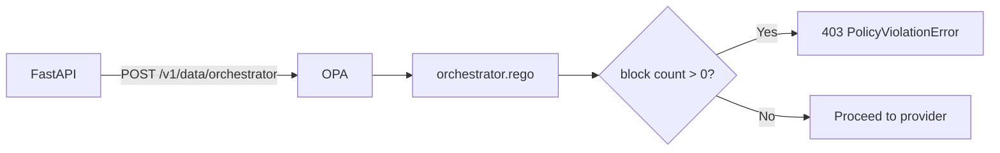

# Module 8 — OPA Governance

## Purpose

Open Policy Agent (OPA) decouples **authorization rules from Python code**. After routing resolves which AI service to use, OPA evaluates whether this tenant may execute this request given sensitivity, tenant identity, and service type (on-prem vs cloud).

---

## Core concepts

1. **Policy as data** — policies live in Postgres, synced to OPA's data API on startup and admin mutations.
2. **Rego evaluation** — `opa/policies/orchestrator.rego` defines allow/deny logic.
3. **Context-aware** — input includes upgraded sensitivity from PII inspect, not just the user's declared level.
4. **Default allow** — `default allow = true`; explicit policies create blocks.
5. **Audit trail** — denials write to `policy_audit_log`.

---

## How it works



### Input shape

```json
{
  "context": {
    "sensitivity": "HIGH",
    "tenant": "acme-corp",
    "service_type": "cloud"
  }
}
```

`sensitivity` comes from ContentInspector upgrade. `service_type` comes from the `ai_services` row (`on-prem` or `cloud`).

### Policy effects (`orchestrator.rego`)

| Effect | Blocks when |
|--------|-------------|
| `deny_all` | Policy condition matches (any request matching sensitivity/tenant filter) |
| `deny_cloud` | `service_type == "cloud"` |
| `allow_onprem_only` | `service_type != "on-prem"` |

### Condition matching

Policies can filter on:
- `sensitivity` — exact match or null (wildcard)
- `tenant` — exact match or null (wildcard)

Example: a policy with `condition: { sensitivity: "HIGH", tenant: "acme-corp" }` and `effect: deny_cloud` blocks acme-corp from cloud models when PII upgraded sensitivity to HIGH.

---

## Sync flow

```
Postgres policies table
  → PolicyService.sync_from_db()
  → OPA PUT /v1/data/policies (bundle with version + hash)
  → Rego reads data.policies.items at evaluation time
```

On every admin policy create/update/delete, FastAPI re-syncs the bundle.

Fallback: if OPA unreachable, `PolicyService` can use Python-side evaluation (configurable).

---

## Key files

| Topic | Files |
|-------|-------|
| Rego policy | `opa/policies/orchestrator.rego` |
| Bootstrap data | `opa/data/policies.json` |
| Python client | `fastapi_backend/app/services/policy_service.py` |
| Admin CRUD | `fastapi_backend/app/api/admin/policies.py` |
| Audit log | `fastapi_backend/app/repositories/policy_audit_repository.py` |
| K8s deployment | `k8s/application/opa.yaml` |

---

## Wired vs scaffolded

| Feature | Status |
|---------|--------|
| OPA Rego evaluation | Active |
| DB → OPA sync on startup | Active |
| Admin policy CRUD | Active |
| Policy audit log | Active |
| Python fallback when OPA down | Configurable |

---

## Trace exercise

1. Read `orchestrator.rego` — identify `default allow`, `block` set, and `should_block` rules.
2. In Admin Portal, create a policy: `effect: deny_cloud`, `tenant: your-tenant`.
3. Send a request routed to a cloud service — expect 403 with policy error in SSE/JSON.
4. Query `policy_audit_log` for the denial record.

---

## Self-check

1. What three fields does OPA receive in `input.context`?
2. What does `deny_cloud` block?
3. Where do policies originate — Rego file or Postgres?
4. When in the pre-flight pipeline does OPA run?
5. What gets logged when a policy denies a request?

---

## Next module

[09-ai-providers.md](09-ai-providers.md) — what happens after OPA allows the request.
