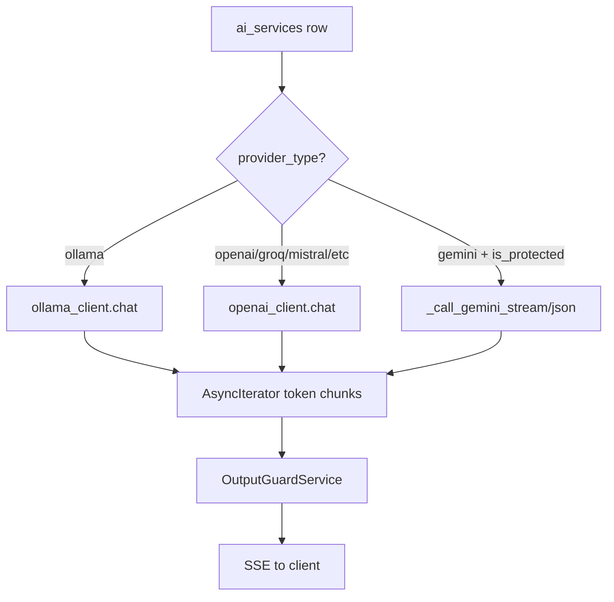

# Module 9 — AI Providers

## Purpose

After pre-flight and OPA approval, the orchestrator **dispatches** the request to the correct AI backend. The `ai_services` table is the routing registry — each row defines provider type, URL, model, auth, and on-prem vs cloud classification.

---

## Core concepts

1. **Service row drives dispatch** — `provider_type`, `provider_url`, `model_name`, `service_type` from DB.
2. **Three dispatch paths** — Ollama, OpenAI-compatible, protected Gemini.
3. **Normalized stream contract** — all providers return `{"token", "done", "usage"}` chunks.
4. **Token usage + quota** — after success, usage estimated if missing and Redis quota incremented.
5. **Output guard on every token** — PII redaction runs on streamed chunks before client sees them.

---

## How it works



### Dispatch logic (`_dispatch_provider_stream/json`)

| Condition | Client used |
|-----------|-------------|
| `provider_type == "gemini"` AND `is_protected == True` | Custom Bard scrape path (`_call_gemini_*`) |
| `provider_type == "ollama"` | `ollama_client.chat()` — POST with `{model, messages, stream}` |
| Everything else | `openai_client.chat()` — OpenAI `/v1/chat/completions` with configurable auth |

### AIService model fields

| Field | Purpose |
|-------|---------|
| `provider_type` | `ollama`, `openai`, `gemini`, etc. |
| `provider_url` | Base URL for HTTP calls |
| `model_name` | Model identifier passed to provider |
| `service_type` | `on-prem` or `cloud` — feeds OPA |
| `api_key`, `auth_header`, `auth_scheme` | Provider authentication |
| `is_protected` | Triggers Gemini special path |

---

## Streaming contract

All providers normalize to:

```json
{"token": "word", "done": false, "usage": null}
{"token": "", "done": true, "usage": {"prompt_eval_count": 10, "eval_count": 50}}
```

FastAPI wraps these in SSE frames: `data: {...}\n\n`

Post-dispatch:
1. Estimate token usage if provider omitted it
2. `QuotaService.increment_usage()`
3. `OutputGuardService.redact_stream_chunk()` per token
4. Update `ai_requests` status to `completed`

---

## Key files

| Topic | Files |
|-------|-------|
| Dispatch logic | `fastapi_backend/app/services/ai_request_service.py` |
| Ollama client | `fastapi_backend/app/infrastructure/ai_provider/ollama_client.py` |
| OpenAI-compatible | `fastapi_backend/app/infrastructure/ai_provider/openai_client.py` |
| Service model | `fastapi_backend/app/models/ai_service.py` |
| Admin CRUD | `fastapi_backend/app/api/admin/services.py` |
| Host LLM (Ollama) | Warmed by `deploy.ps1` — `llama3.2:3b`, `qwen2.5-coder:7b` |

---

## Wired vs scaffolded

| Feature | Status |
|---------|--------|
| Ollama streaming | Active |
| OpenAI-compatible APIs | Active |
| Protected Gemini path | Active when configured |
| Token usage tracking | Active |
| Quota increment post-success | Active |

---

## Trace exercise

1. Query `ai_services` table (admin UI or SQL) — list provider_type and service_type for each row.
2. Send a `general_chat` request — confirm in logs it hits Ollama URL.
3. Watch SSE in browser DevTools — observe token frames and final `done:true` metadata with intent info.

---

## Self-check

1. How does the orchestrator choose between Ollama and OpenAI client?
2. What field determines OPA cloud vs on-prem evaluation?
3. What is the normalized chunk shape all providers must return?
4. When is Redis quota incremented?
5. Where does output PII redaction happen relative to provider response?

---

## Next module

[10-data-layer.md](10-data-layer.md) — where all state is persisted.
