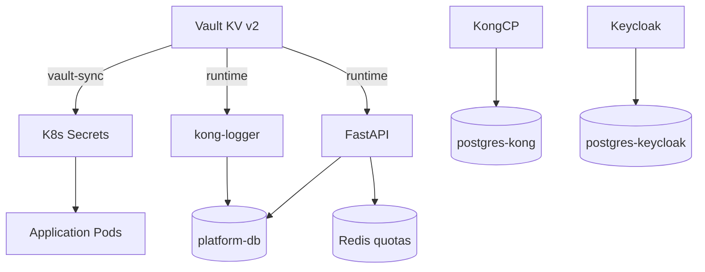

# Module 10 — Data Layer

## Purpose

The platform runs **three PostgreSQL instances**, Redis for ephemeral quota counters, and Vault for secrets. Multi-tenant isolation is enforced at the database kernel via Row-Level Security (RLS), not just application filters.

---

## Core concepts

1. **Three Postgres databases** — platform (business data), Kong (gateway config), Keycloak (identity).
2. **RLS as physical barrier** — `app.current_tenant` session var filters every query automatically.
3. **Redis for quotas** — daily token counters; not the source of truth for audit (Postgres is).
4. **Vault at deploy time + runtime** — secrets seeded to Vault, synced to K8s Secrets; FastAPI and kong-logger also read Vault at runtime.
5. **Intent routing in DB** — `intent_routing` table maps intent labels to service IDs; hot-reloaded every 30s.

---

## How it works



### PostgreSQL instances

| Instance | Namespace | Stores |
|----------|-----------|--------|
| `platform-db` | ai-data | Tenants, ai_requests, security_events, policies, intent_routing, api_usage_records |
| `postgres-kong` | ai-data | Kong routes, plugins, consumers |
| `postgres-keycloak` | ai-data | Users, realms, sessions |

### Key platform tables

| Table | Purpose |
|-------|---------|
| `ai_requests` | Every AI request lifecycle (status, intent, sensitivity) |
| `security_events` | Injection blocks, PII redactions, permission denials |
| `policy_audit_log` | OPA policy evaluation results |
| `intent_routing` | intent_label → service_id mapping |
| `tenant_service_permissions` | Which tenants may use which services |
| `ai_services` | Provider registry (URL, model, type) |
| `api_usage_records` | Kong access logs (AWS-style schema from kong-logger) |
| `usage_token_logs` | Per-request token consumption |

### RLS mechanism

1. `get_db_with_user()` sets `SET app.current_tenant = '<tenant_id>'`
2. Postgres RLS policies on tenant-scoped tables filter rows
3. ORM `tenant_filters.py` adds `tenant_id` to queries as defense-in-depth

Even if Python sends `WHERE tenant_id = wrong_value`, RLS refuses cross-tenant rows.

---

## Vault secrets flow

```
deploy.ps1
  → vault-seed.ps1 writes KV paths:
       secret/platform/postgres, secret/kong/postgres, secret/keycloak/postgres
       secret/redis/platform, secret/kong/cluster (mTLS certs)
       secret/monitoring/grafana, secret/ml/huggingface
  → vault-sync-k8s-secrets.ps1 → K8s Secrets per namespace
```

Runtime Vault readers: FastAPI (`vault_secrets.py`), kong-logger (`server.js`).

---

## Redis

| Use | Key pattern | Behavior |
|-----|-------------|----------|
| Token quotas | Per-tenant daily counter | Checked Phase B; incremented post-success |
| Intent classifier cache | Tenant + text fingerprint | L2 cache for classification results |

Quota fail-open: if Redis down, requests proceed.

---

## Key files

| Topic | Files |
|-------|-------|
| Platform schema | `backend/scripts/init-platform-db.sql` |
| Usage/billing schema | `backend/scripts/init-platform-db-usage.sql` |
| RLS session | `fastapi_backend/app/infrastructure/db/session.py` |
| ORM filters | `fastapi_backend/app/infrastructure/db/tenant_filters.py` |
| Vault seed | `scripts/vault-seed.ps1` |
| Vault sync | `scripts/vault-sync-k8s-secrets.ps1` |
| Runtime Vault | `fastapi_backend/app/core/vault_secrets.py` |
| Log retention | `k8s/application/log-retention-cronjob.yaml` |

---

## Wired vs scaffolded

| Feature | Status |
|---------|--------|
| RLS tenant isolation | Active |
| Three Postgres instances | Active |
| Vault dev mode | Active in K8s deploy |
| Redis quotas | Active (fail-open) |
| Log retention cronjob | Active |

---

## Trace exercise

1. Read `init-platform-db.sql` — find RLS policy definitions.
2. After an AI chat, query `ai_requests` for your tenant's latest row.
3. Query `api_usage_records` — find the Kong access log entry with matching `requestId`.
4. List Vault paths in `vault-seed.ps1` and map each to a K8s Secret.

---

## Self-check

1. How many Postgres instances exist and what does each store?
2. How does RLS know which tenant is querying?
3. What table stores Kong access logs transformed by kong-logger?
4. What happens to AI requests when Redis is unavailable?
5. Name two runtime Vault consumers vs deploy-time-only secrets.

---

## Next module

[11-monitoring-logging.md](11-monitoring-logging.md) — observability across all components.
