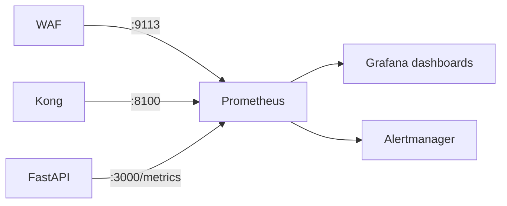
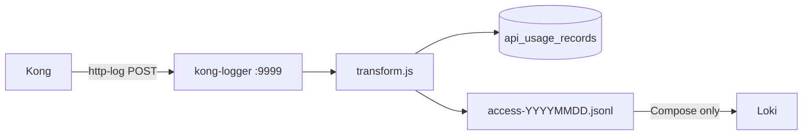

# Module 11 — Monitoring & Logging

## Purpose

Observability spans **metrics** (Prometheus/Grafana), **access logs** (Kong → kong-logger → Postgres), and **application audit** (security_events, ai_requests). Correlation IDs tie a single request across all layers.

---

## Core concepts

1. **Three metric sources** — WAF (:9113), Kong DP (:8100), FastAPI (:3000/metrics).
2. **Kong http-log pipeline** — every proxied request POSTed to kong-logger, transformed to AWS-style records.
3. **Postgres-backed dashboards** — Grafana queries `api_usage_records` for billing-style analytics.
4. **Correlation ID propagation** — Kong `correlation-id` plugin → FastAPI middleware → logs and response headers.
5. **Loki on K8s** — Promtail sidecars in kong-logger and WAF pods ship JSONL / ModSecurity audit logs to Loki; dashboard **Edge Access Logs (Kong + WAF)** (default **24h**, Kong table from Postgres, WAF from Loki with filters).

---

## How it works

### Metrics path

| Scrape target | Job name | Dashboard |
|---------------|----------|-----------|
| WAF nginx-exporter :9113 | waf | `waf-edge-security.json` |
| Kong DP :8100 | kong | `kong_official.json` |
| FastAPI :3000 | fastapi_backend | `fastapi_app.json` |

Scrape config: `monitoring/prometheus.k8s.yml` (15s interval).

### Access log path

Kong global `http-log` plugin sends JSON payload to `kong-logger/logs`. `transform.js` converts to AWS API Gateway-style schema with `requestId`, `status`, `responseLatency`, `waf.action`, and `billing` block.

### Application audit (separate from Kong logs)

| Store | Content |
|-------|---------|
| `ai_requests` | AI lifecycle (intent, status, sensitivity) |
| `security_events` | Blocks, redactions, denials |
| `policy_audit_log` | OPA decisions |
| `usage_token_logs` | Token consumption |

---

## Grafana dashboards

| Dashboard | Data source | Shows |
|-----------|-------------|-------|
| `kong_official.json` | Prometheus | Gateway throughput, latency, upstream health |
| `fastapi_app.json` | Prometheus | Backend HTTP metrics |
| `waf-edge-security.json` | Prometheus | WAF connections, request rate |
| `api_gateway_overview.json` | Postgres | Billing-style usage aggregates |
| `api_gateway_per_api.json` | Postgres | Per-route usage |
| `api_gateway_per_consumer.json` | Postgres | Per-consumer usage |
| `nextora_bi.json` | Postgres | Business analytics |

Access Grafana via `start-ui.ps1` port-forward to `:3001` or Kong route `/grafana`.

---

## Alerts

File: `monitoring/prometheus/rules/api-gateway-alerts.yml`

| Alert | Triggers when |
|-------|---------------|
| `WafTargetDown` | WAF metrics unreachable |
| `KongTargetDown` | Kong metrics unreachable |
| `FastApiTargetDown` | FastAPI metrics unreachable |
| `ElevatedFastApi5xxRate` | High 5xx rate |
| `KongP95LatencyHigh` | Kong latency spike |
| `KongLoggerIngestionStalled` | No recent access log writes (Grafana-managed) |

Note: K8s Prometheus deployment mounts `prometheus.k8s.yml` but may not mount alert rule files — verify in `k8s/frontend-and-monitoring.yaml`.

---

## Correlation ID flow

1. Kong `correlation-id` plugin generates `X-Request-ID`
2. FastAPI `CorrelationIdMiddleware` reads or generates ID
3. ID appears in structured logs and response headers
4. Kong access log includes request ID for cross-layer lookup

---

## Key files

| Topic | Files |
|-------|-------|
| Observability guide | `monitoring/README.md` |
| K8s scrape config | `monitoring/prometheus.k8s.yml` |
| Alert rules | `monitoring/prometheus/rules/api-gateway-alerts.yml` |
| Kong log receiver | `kong-logger/server.js` |
| Log transform | `kong-logger/transform.js` |
| Postgres sink | `kong-logger/sinks/postgres.js` |
| Usage schema | `backend/scripts/init-platform-db-usage.sql` |
| Grafana provisioning | `monitoring/grafana/provisioning/` |
| Admin metrics API | `fastapi_backend/app/api/admin/metrics.py` |

---

## Wired vs scaffolded

| Feature | K8s | Compose |
|---------|-----|---------|
| Prometheus + Grafana | Active | Active |
| WAF metrics | Active | Not scraped |
| Loki + Promtail sidecars | Active (kong-logger + WAF) | Active (host-mounted JSONL) |
| Alert rules in Prometheus | May be missing volume mount | Active |
| Intent classifier metrics scrape | NP allows; not in prometheus.k8s.yml | — |

---

## Trace exercise

1. Open Grafana (`start-ui.ps1`) — view Kong + WAF + FastAPI panels side by side.
2. Send an AI request; copy `X-Request-ID` from response headers.
3. Query `api_usage_records` for that request ID.
4. Tail WAF audit log for a blocked SQLi probe — compare with allowed AI request.

---

## Self-check

1. What three components expose Prometheus metrics?
2. How does a Kong access log reach Postgres?
3. What schema style does kong-logger use for access records?
4. What ties logs across WAF, Kong, and FastAPI?
5. Where do you view live Kong JSONL and WAF audit logs in Grafana on K8s?

---

## Next module

[12-deployment-ops.md](12-deployment-ops.md) — how the full stack gets deployed.
