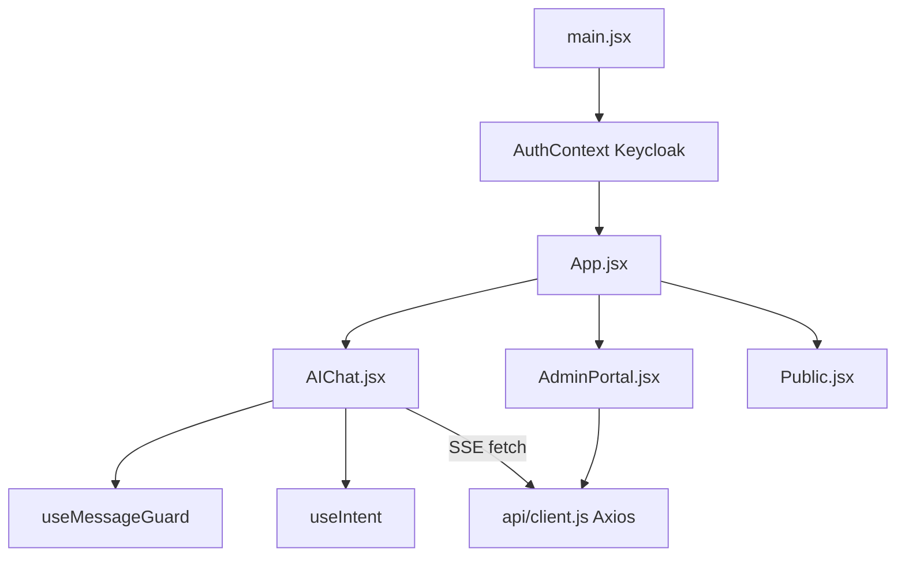

# Module 13 — Admin Portal & Frontend

## Purpose

The React SPA is the user interface for AI chat and platform administration. It handles Keycloak login, SSE streaming consumption, client-side message guards, and admin operations for policies, services, quotas, and Kong plugins.

---

## Core concepts

1. **AuthContext wraps the app** — Keycloak `login-required`; token refreshed every 30s.
2. **AIChat uses native fetch for SSE** — Axios cannot stream SSE; Bearer token set manually.
3. **Message guard before send** — `useMessageGuard` blocks injection patterns client-side.
4. **Admin Portal is a separate view** — governance CRUD, Grafana embed, Kong plugin marketplace.
5. **Relative API paths** — browser calls `/api/v1/*` which Kong routes to FastAPI.

---

## How it works

### App structure

### AIChat SSE flow

| Step | Action |
|------|--------|
| 1 | User selects intent (or `auto`) and types message |
| 2 | `useMessageGuard` validates — hard block or soft PII warn modal |
| 3 | `fetch("/api/v1/ai/request")` with `Authorization: Bearer`, `Accept: text/event-stream` |
| 4 | Body: `{ intent, payload: { messages }, metadata }` |
| 5 | Read SSE stream — parse `data: {...}` frames |
| 6 | Append tokens to message bubble; show intent badge from final metadata |
| 7 | Handle error frames (policy, quota, injection) via `parseSseChatError` |

Traffic path: Browser → WAF → Kong → FastAPI (same as any API call).

### Admin Portal capabilities

| Section | Backend API | Purpose |
|---------|-------------|---------|
| Services | `/api/v1/service-governance/*` | CRUD AI provider registry |
| Policies | `/api/v1/admin/policies/*` | OPA policy management |
| Intent mappings | `/api/v1/admin/intent-mappings/*` | intent → service_id |
| Quotas | `/api/v1/admin/quotas/*` | Tenant token limits |
| Security events | `/api/v1/admin/security-events/*` | Audit viewer |
| Gateway plugins | `/api/v1/admin/gateway-plugins/*` | Kong Admin API proxy |
| Metrics / health | `/api/v1/admin/metrics`, health badges | Platform status |
| Grafana embed | iframe to `/grafana` via Kong | Dashboards in admin UI |

Provider templates in AdminPortal pre-fill service wizard (OpenAI, Groq, Ollama, etc.).

---

## Key files

| Topic | Files |
|-------|-------|
| Auth | `frontend/src/context/AuthContext.jsx` |
| API client | `frontend/src/api/client.js` |
| AI chat + SSE | `frontend/src/components/AIChat.jsx` |
| Admin UI | `frontend/src/components/AdminPortal.jsx` |
| Message guard | `frontend/src/hooks/useMessageGuard.js` |
| Intent selection | `frontend/src/hooks/useIntent.js` |
| SSE error parsing | `frontend/src/utils/chatErrors.js` |
| Stream dedup | `frontend/src/utils/streaming.js` |
| App routing | `frontend/src/App.jsx` |

### Backend admin APIs

| Router | File |
|--------|------|
| Policies | `fastapi_backend/app/api/admin/policies.py` |
| Services | `fastapi_backend/app/api/admin/services.py` |
| Intent mappings | `fastapi_backend/app/api/admin/intent_mappings.py` |
| Quotas | `fastapi_backend/app/api/admin/quotas_admin.py` |
| Gateway plugins | `fastapi_backend/app/api/admin/gateway_plugins.py` |
| Security events | `fastapi_backend/app/api/admin/security_events_admin.py` |
| Metrics | `fastapi_backend/app/api/admin/metrics.py` |

---

## Wired vs scaffolded

| Feature | Status |
|---------|--------|
| Keycloak login | Active |
| SSE streaming chat | Active |
| Client message guard | Active |
| Admin governance CRUD | Active |
| Grafana embed in admin | Active |
| Kong plugin marketplace UI | Active (mutates live Kong via Admin API) |

---

## Trace exercise

1. Log in, open DevTools Network, send a chat message — inspect SSE event stream frames.
2. Open Admin Portal — create a test policy and verify it appears in OPA data.
3. Check `api/client.js` — see how Bearer token and `kong-header` are set on Axios calls.
4. Trigger message guard with "ignore all previous instructions" — confirm UI blocks before network call.

---

## Self-check

1. Why does AIChat use fetch instead of Axios for streaming?
2. What headers are required on the AI request?
3. Name three admin operations available in AdminPortal.
4. Where does the frontend get the JWT token?
5. What happens client-side before a message is sent to the backend?

---

## Next module

[99-end-to-end-trace.md](99-end-to-end-trace.md) — capstone exercise tying all modules together.
