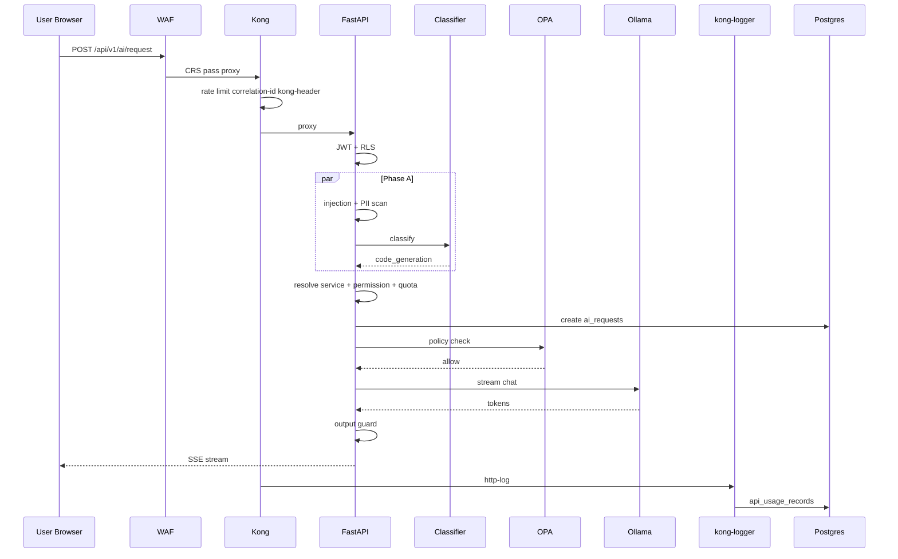

# Capstone — End-to-End Request Trace

## Purpose

This exercise ties **every module together**. Trace a single `POST /api/v1/ai/request` with `intent: "auto"` from browser click through to Grafana/Postgres visibility. Complete this without notes to confirm you understand the full platform.

---

## Scenario

User logs in, selects **Auto Intent**, types: *"Write a Python function to sort a list"*, and receives a streamed response.

---

## Full trace checklist

Mark each hop as you explain it. Module references point to study guides.

| # | Hop | Component | Module | What happens |
|---|-----|-----------|--------|--------------|
| 1 | Browser init | Keycloak OIDC | [04](04-identity-auth.md) | `login-required`; JWT with `tenant_id` issued |
| 2 | Client guard | `useMessageGuard.js` | [13](13-admin-frontend.md) | Pattern check; no block for this message |
| 3 | HTTP POST | Browser fetch | [13](13-admin-frontend.md) | `POST /api/v1/ai/request`, Bearer token, `Accept: text/event-stream` |
| 4 | DNS / LB | WAF LoadBalancer | [00](00-architecture-overview.md) | Traffic hits WAF :80 (only public entry) |
| 5 | CRS inspect | ModSecurity WAF | [01](01-edge-waf.md) | AI path exclusions apply; SQLi/XSS rules skipped for `/api/v1/ai/` |
| 6 | Proxy | WAF → Kong | [01](01-edge-waf.md) | Allowed request forwarded to `kong-dp:8000` |
| 7 | NetworkPolicy | K8s kernel | [03](03-network-zero-trust.md) | Only WAF may ingress Kong proxy port |
| 8 | Route match | Kong DP | [02](02-kong-gateway.md) | Route `fastapi-ai` matches path |
| 9 | Rate limit | Kong plugin | [02](02-kong-gateway.md) | 10/s, 100/min, 1000/hr check |
| 10 | Size limit | Kong plugin | [02](02-kong-gateway.md) | Payload ≤ 1 MB |
| 11 | Correlation ID | Kong plugin | [11](11-monitoring-logging.md) | `X-Request-ID` generated |
| 12 | Kong stamp | request-transformer | [02](02-kong-gateway.md) | `kong-header: true` added |
| 13 | http-log | Kong plugin | [11](11-monitoring-logging.md) | Access log POST to kong-logger (async) |
| 14 | Proxy upstream | Kong → FastAPI | [02](02-kong-gateway.md) | `fastapi.ai-application:3000` |
| 15 | Kong header check | `verify_kong_header` | [05](05-ai-orchestration.md) | 403 if header missing |
| 16 | JWT verify | `get_current_user` | [04](04-identity-auth.md) | JWKS RS256 validation |
| 17 | RLS session | `get_db_with_user` | [04](04-identity-auth.md) | `SET app.current_tenant` |
| 18 | Route handler | `ai.py` | [05](05-ai-orchestration.md) | Branches to `submit_stream()` |
| 19 | Phase A parallel | PromptSecurity | [06](06-security-services.md) | Injection scan — pass |
| 20 | Phase A parallel | ContentInspector | [06](06-security-services.md) | PII scan — likely LOW/MEDIUM |
| 21 | Phase A parallel | IntentClassifier | [07](07-intent-classifier.md) | `POST /classify` → `code_generation` |
| 22 | Phase B | IntentCacheService | [07](07-intent-classifier.md) | `code_generation` → `service_id` |
| 23 | Phase B | Permission check | [06](06-security-services.md) | Tenant allowed for service? |
| 24 | Phase B | Quota check | [06](06-security-services.md) | Redis daily tokens OK? |
| 25 | Phase B | Load service | [09](09-ai-providers.md) | Read `ai_services` row |
| 26 | Phase C | Persist | [10](10-data-layer.md) | Insert `ai_requests` row |
| 27 | Phase D | OPA | [08](08-opa-governance.md) | Evaluate `{sensitivity, tenant, service_type}` |
| 28 | Dispatch | Provider client | [09](09-ai-providers.md) | Ollama or cloud based on service row |
| 29 | Stream tokens | SSE frames | [05](05-ai-orchestration.md) | `data: {"token":"..."}\n\n` |
| 30 | Output guard | Presidio | [06](06-security-services.md) | Redact PII in each chunk |
| 31 | Quota increment | Redis | [06](06-security-services.md) | Add token usage |
| 32 | Complete | Postgres | [10](10-data-layer.md) | Update `ai_requests` status |
| 33 | Response path | Kong → WAF → Browser | [02](02-kong-gateway.md) | SSE stream to client |
| 34 | Access log | kong-logger | [11](11-monitoring-logging.md) | Transform → `api_usage_records` |
| 35 | Metrics | Prometheus | [11](11-monitoring-logging.md) | Counters incremented on Kong/FastAPI |
| 36 | UI render | AIChat | [13](13-admin-frontend.md) | Markdown render + intent badge |

---

## Diagram



---

## Hands-on verification

With cluster running (`deploy.ps1` + `start-ui.ps1`):

1. **Send the scenario message** in the UI with Auto Intent.
2. **Copy `X-Request-ID`** from response headers (DevTools).
3. **Query Postgres:**
   ```sql
   SELECT * FROM ai_requests ORDER BY created_at DESC LIMIT 1;
   SELECT * FROM api_usage_records WHERE request_id = '<your-id>';
   ```
4. **Check Grafana** — Kong request rate spike, FastAPI latency panel.
5. **Check FastAPI logs** — find intent resolution log line with `code_generation`.
6. **Optional:** Call classifier directly and compare label.

---

## Failure scenarios to trace (optional)

Repeat the checklist for these cases:

| Scenario | Expected block point | Module |
|----------|---------------------|--------|
| SQLi probe on `/?id=1' OR '1'='1` | WAF 403 | [01](01-edge-waf.md) |
| No JWT token | FastAPI 401 | [04](04-identity-auth.md) |
| Direct FastAPI call (no kong-header) | FastAPI 403 | [03](03-network-zero-trust.md) |
| "ignore all previous instructions" | PromptSecurity 403 | [06](06-security-services.md) |
| `deny_cloud` policy + cloud service | OPA 403 | [08](08-opa-governance.md) |
| Exceed rate limit | Kong 429 | [02](02-kong-gateway.md) |

---

## Self-check (capstone)

Answer all of these without opening any file:

1. How many namespaces does the request traverse (including data writes)?
2. At which exact phase does intent classification run?
3. What three things does OPA receive in its context?
4. Where does the Kong access log end up?
5. Why does the WAF not block a Python code prompt?
6. What header proves the request came through Kong?
7. What table records the AI request lifecycle vs the HTTP access log?

---

## Completion criteria

You have finished the deep-dive curriculum when you can:

- Walk through all 36 hops above from memory
- Explain any failure scenario block point
- Draw the architecture diagram with 4 namespaces
- Distinguish wired vs scaffolded features at the edge
- Run the hands-on verification steps successfully

Return to any module where self-check answers were weak: [00-architecture-overview.md](00-architecture-overview.md)
